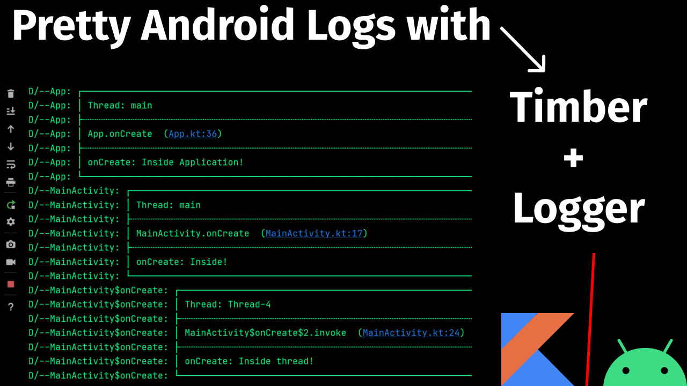

<h1 align="center">Pretty Timber Android Logcat</h1></br>

<p align="center">
Timber + Logger Integration
</p>
<br>

<p align="center">
Video Instructions: https://youtu.be/zoS_i8VshCk
</p>

<br>

<p align="center">
  <a href="#"></a>
  <a href="https://github.com/androiddevnotes"></a>

</p>

<br>
<p align="center">
</img>
</p>

<br>

## Code

[App.kt](app/src/main/java/com/androiddevnotes/prettytimberandroidlogcat/App.kt)

```kotlin 
class App : Application() {
    override fun onCreate() {
        super.onCreate()

        val formatStrategy: FormatStrategy = PrettyFormatStrategy.newBuilder()
            .showThreadInfo(true) // (Optional) Whether to show thread info or not. Default true
            .methodCount(1) // (Optional) How many method line to show. Default 2
            .methodOffset(5) // Set methodOffset to 5 in order to hide internal method calls
            .tag("") // To replace the default PRETTY_LOGGER tag with a dash (-).
            .build()

        Logger.addLogAdapter(AndroidLogAdapter(formatStrategy))


        Timber.plant(object : Timber.DebugTree() {

            override fun log(
                priority: Int, tag: String?, message: String, t: Throwable?
            ) {
                Logger.log(priority, "-$tag", message, t)
            }
        })

        // Usage
        Timber.d("onCreate: Inside Application!")
    }
}

// Dependencies needed in build.gradle (app) file - Remember to update version if required.
// implementation 'com.orhanobut:logger:2.2.0'
// implementation 'com.jakewharton.timber:timber:4.7.1'
```

<br>

## Dependencies

```groovy
implementation 'com.jakewharton.timber:timber:4.7.1'

// https://github.com/JakeWharton/timber
```


```groovy
implementation 'com.orhanobut:logger:2.2.0'

// https://github.com/orhanobut/logger
```


## :computer: Find us on

<div align="center">
	<a href="https://github.com/androiddevnotes"> GitHub </a> / <a href="https://discord.gg/vBnEhuC"> Discord </a> / <a href="https://twitter.com/androiddevnotes"> Twitter </a> / <a href="https://www.instagram.com/androiddevnotes"> Instagram </a> / <a href="https://www.youtube.com/channel/UCQATLaT0xKkSm-KKVQzpu0Q"> YouTube </a> / <a href="https://medium.com/@androiddevnotes"> Medium </a>
	<br><br>
    </img>
</div>